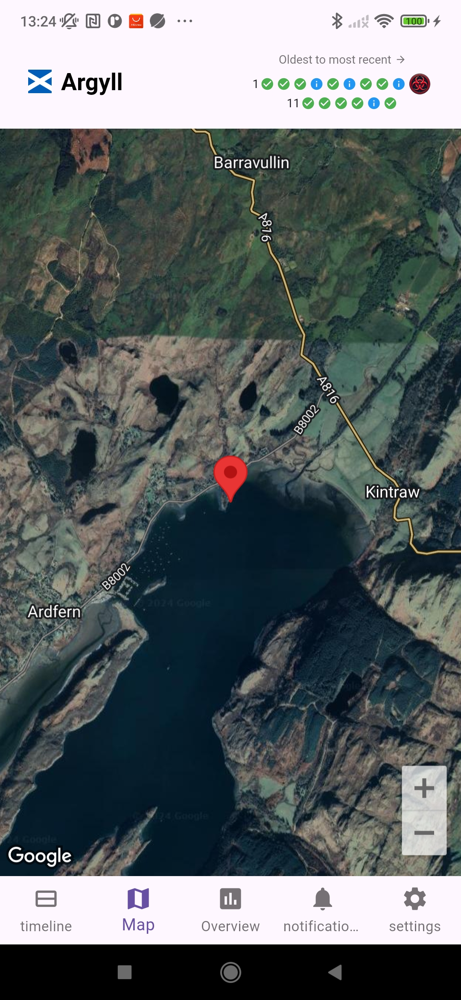
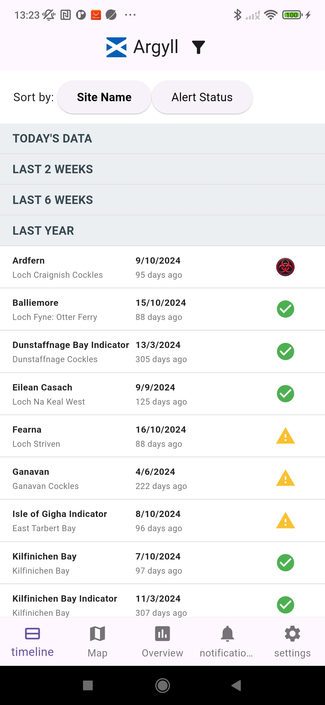

# Flutter Example Snippets

⚠️This code will NOT work standalone.⚠️
 Might be useful though... 

This repository contains example snippets of Flutter code that demonstrate:

- Google Maps integration with dynamic markers (MapPage.dart).
  

- Data filtering and sorting with a clean UI (TimelinePage.dart).
  

---

## Important Notes

1. **These files will NOT work standalone**:
    - They are intended to provide ideas.
    - External dependencies, project setup, and additional files are required for full functionality.

2. **Custom Placeholders**:
    - Replace placeholders like `SiteData` and other imports with your own implementations.
    - For example, `get_data.dart` and `googleMapRegionCentres.dart` are custom to the original project.

3. **How to Use**:
    - Use these examples as references to build your own features.
    - Adapt them to your specific project structure and requirements.
